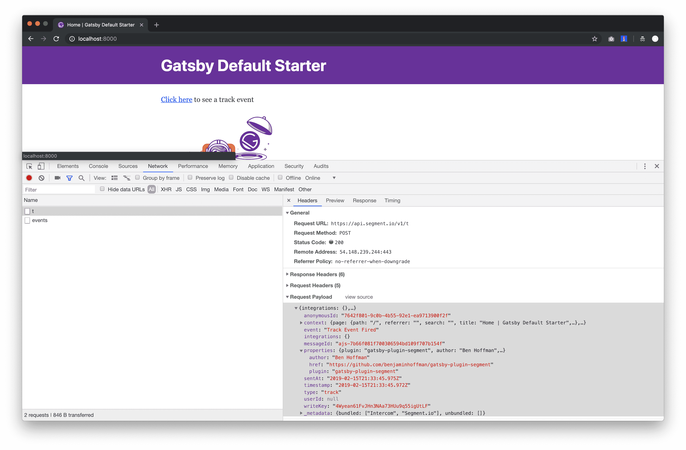
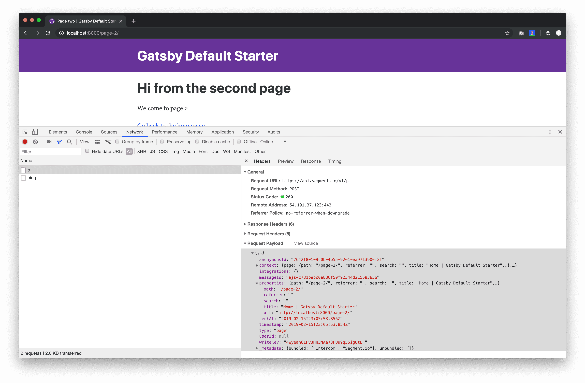
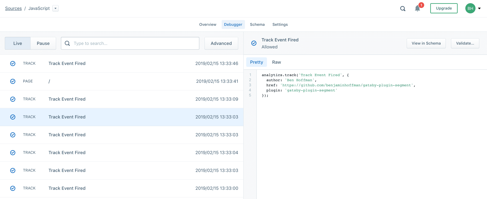

# Example Usage of `gatsby-plugin-segment`

To create this example, I used Gatsby's default starter. Then I only modified two files: `src/pages/index.js` and `/gatsby-config.js`. It's a very simple example that doesn't really need to get started but if you still want to get it running, do the following:

```bash
$ cd example/
$ yarn
$ yarn develop
```

Then open your browser's dev tools. In the _Console_ tab, you should see the message I left for you. And if you click on the _Network_ tab, you'll see the call to Segment.

Note that if you'd like to send events to your own Segment account, you need to update the API keys in `gatsby-config.js`.

## Track Event



## Track Page



## Segment UI


